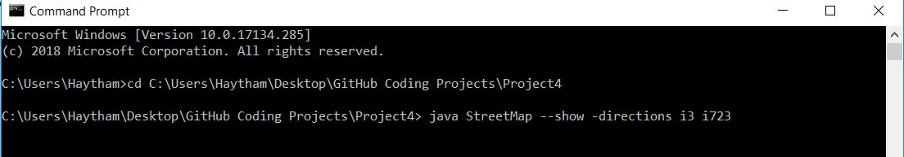
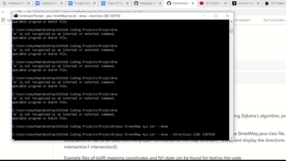

# Mapping-of-NY
This project is for mapping and finding the shortest straight line between two points using Dijkstra's algorithm, provided that the intersection points of the desired map exists. 

The project only works if the files for the intersection points are in the same folder as the StreetMap.java class file. The commandline has to be used with the proper commands for the map to show (--show) and display the directions (--directions intersection1 intersection2) 

In case it is desired to show the map with the directions between two points, then the commands should be used as in:

Example files of UofR mapping coordinates and NY state can be found for testing the code. 

